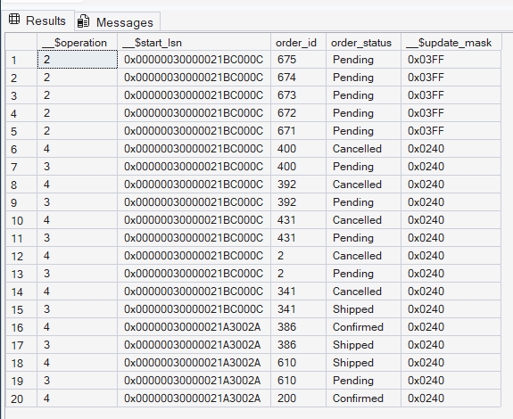
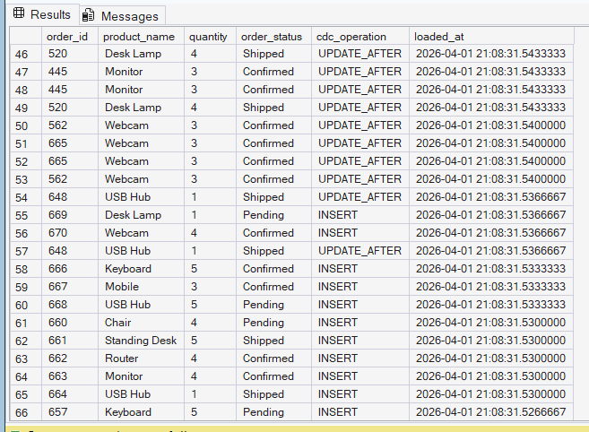
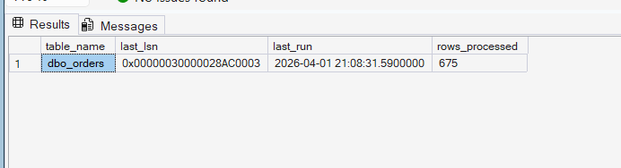
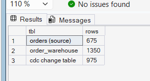

# CDC Pipeline — Change Data Capture Incremental Load Engine
**Tech Stack:** Python 3.11 | SQL Server 2025 Developer Edition | pyodbc | Pandas

---

## What is CDC?

Change Data Capture (CDC) is a SQL Server feature that tracks every
INSERT, UPDATE, and DELETE on a monitored table — automatically, in the
background — using the transaction log. Instead of reading the entire
table on every pipeline run, your ETL reads only what changed since the
last run.

```
Full Load (traditional):   Read ALL rows → compare → process changes
CDC (this project):        Read ONLY changed rows → process directly
```

**Why it matters:** For a table with 10 million rows where only 500
changed since last run — full load processes 10 million rows every time.
CDC processes 500. This is how production ETL pipelines work at scale.

---

## Architecture

```
orders table (source)
      │
      │  SQL Server monitors every INSERT / UPDATE / DELETE
      │  automatically via transaction log
      ▼
cdc.dbo_orders_CT (CDC change table)
      │  Hidden system table — SQL Server writes here automatically
      │  Each row has __$operation: 1=DELETE 2=INSERT 3=UPDATE_BEFORE 4=UPDATE_AFTER
      │  Each row has __$start_lsn: unique Log Sequence Number
      ▼
get_lsn_range()
      │  Reads last processed LSN from cdc_watermark table
      │  Gets current max LSN from SQL Server
      │  Defines the window: "process only changes between these two LSNs"
      ▼
read_cdc_changes()
      │  Calls cdc.fn_cdc_get_all_changes_dbo_orders(lsn_from, lsn_to)
      │  Returns DataFrame of only changed rows
      ▼
process_changes()
      │  INSERT  (op=2) → INSERT into orders_warehouse
      │  UPDATE  (op=4) → UPDATE in orders_warehouse (upsert if missing)
      │  DELETE  (op=1) → Mark as DELETED (never hard delete in warehouse)
      │  op=3 skipped   → UPDATE_BEFORE image not needed
      ▼
update_watermark()
      │  Saves lsn_to to cdc_watermark table
      │  Next run starts from this LSN
      ▼
orders_warehouse (destination)
      └── cdc_operation column shows INSERT / UPDATE / DELETE per row
```

---

## SQL Objects Created

| Object | Type | Purpose |
|---|---|---|
| `orders` | Table | Source — monitored by CDC |
| `orders_warehouse` | Table | Destination — incremental loads land here |
| `cdc_watermark` | Table | Bookmark — stores last processed LSN per table |
| `cdc_error_log` | Table | Error tracking per pipeline run |
| `cdc.dbo_orders_CT` | System Table | Auto-created by SQL Server — stores raw changes |

---

## Key Concepts Demonstrated

- **CDC enable/disable** — database level + table level
- **LSN (Log Sequence Number)** — SQL Server's change bookmark system
- **Watermark pattern** — storing high-water mark for incremental runs
- **Operation codes** — handling INSERT / UPDATE_AFTER / DELETE separately
- **Soft deletes in warehouse** — never hard delete, mark as DELETED
- **Upsert logic** — UPDATE with fallback INSERT if row missing
- **Incremental load** — only changed rows processed per run

---

## Project Structure

```
Project B - CDC Pipeline/
│
├── data/
│   └── initial_orders.csv         ← generated initial records  
|
├── sql/
│   ├── cdc_setup.sql              ← full database + CDC setup
│   └── cdc_query.sql              ← CDC query run
|
├── logs/
│   ├── cdc_pipeline.log           ← run-by-run pipeline log
│   ├── order_transaction.log      ← New load records CDC log
|   └── orders_load.log            ← initial records log
|
├── screenshots/
│   ├── 01_cdc_change_table.png    ← raw CDC change table
│   ├── 02_warehouse_results.png   ← orders_warehouse with operations
│   ├── 03_watermark.png           ← LSN watermark progress
│   └── 04_pipeline_summary.png    ← summary counts
│
├── cdc_pipeline.py                ← main CDC ETL pipeline
├── generate_orders.py             ← simulates initial orders
├── generate_transactions.py       ← simulates 3 rounds of changes
├── load_orders.py                 ← loading data to sql server
├── requirements.txt
├── cdc_migration_issues_log.md    ← real bugs hit + fixes applied
└── README.md
```

---

## How to Run

**Prerequisites:**
- SQL Server 2025 Developer Edition (CDC not available in Express)
- Python 3.11+
- pyodbc, pandas installed

**1. Install dependencies**
```bash
pip install pandas pyodbc sqlalchemy
```

**2. Set up database and enable CDC**
```bash
# Open SSMS → connect to localhost → run:
cdc_setup.sql
```

**3. Verify CDC is enabled**
```sql
SELECT name, is_cdc_enabled FROM sys.databases WHERE name = 'SCD_Project';
-- is_cdc_enabled must = 1

SELECT capture_instance FROM cdc.change_tables;
-- must show: dbo_orders
```

**4. Run first pipeline pass (picks up initial inserts)**
```bash
python cdc_pipeline.py
```

**5. Generate transaction rounds**
```bash
python generate_transactions.py
# Enter 1 → new orders
# Run pipeline again

python generate_transactions.py
# Enter 2 → status updates
# Run pipeline again

python generate_transactions.py
# Enter 3 → cancellations + new orders
# Run pipeline again
```

---

## Sample Pipeline Output

```
INFO | CDC Pipeline Started — 2026-04-01 20:35:12
INFO | First run - starting from minimum LSN
INFO | LSN range: 00000024000003... → 00000024000004...
INFO | CDC changes found: 5 raw records
INFO | Breakdown: INSERT=5 | UPDATE=0 | DELETE=0
INFO | Loaded 5 changes to orders_warehouse
INFO | Watermark updated → LSN: 00000024000004...
INFO | Pipeline completed — 5 rows processed

INFO | CDC Pipeline Started — 2026-04-01 20:40:22
INFO | Resuming from last processed LSN
INFO | CDC changes found: 20 raw records
INFO | Breakdown: INSERT=20 | UPDATE=0 | DELETE=0
INFO | Loaded 20 changes to orders_warehouse
INFO | Watermark updated
INFO | Pipeline completed — 20 rows processed

INFO | CDC Pipeline Started — 2026-04-01 20:45:10
INFO | Resuming from last processed LSN
INFO | CDC changes found: 20 raw records
INFO | Breakdown: INSERT=0 | UPDATE=20 | DELETE=0
INFO | Loaded 20 changes to orders_warehouse
INFO | Pipeline completed — 20 rows processed
```

---

## Screenshots

### CDC Change Table — Raw SQL Server capture

*Auto-generated by SQL Server — shows __$operation codes and LSN values*

### Orders Warehouse — Incremental loads result

*INSERT / UPDATE / DELETE operations captured across 3 pipeline runs*

### Watermark — LSN bookmark progression

*LSN advancing with each run — proves incremental not full load*

### Pipeline Summary

*Row counts across source, CDC change table, and warehouse*

---

## Validation Queries

```sql
-- What's in the warehouse?
SELECT cdc_operation, COUNT(*) as count
FROM orders_warehouse
GROUP BY cdc_operation;

-- Watermark — last LSN processed
SELECT table_name, last_run, rows_processed, status
FROM cdc_watermark
ORDER BY last_run DESC;

-- Raw CDC change table
SELECT TOP 20 __$operation, order_id, order_status
FROM cdc.dbo_orders_CT
ORDER BY __$start_lsn DESC;

-- Source vs warehouse comparison
SELECT 'orders (source)'  AS tbl, COUNT(*) AS rows FROM orders
UNION ALL
SELECT 'orders_warehouse', COUNT(*) FROM orders_warehouse
UNION ALL
SELECT 'cdc change table', COUNT(*) FROM cdc.dbo_orders_CT;
```

---

## Interview Q&A

**Q: What is CDC and how does it work?**
CDC is SQL Server's built-in change tracking feature. When enabled on
a table, SQL Server reads its own transaction log and copies every
INSERT, UPDATE, and DELETE into a hidden change table. My pipeline
reads that change table using LSN-based range queries — processing
only rows that changed since the last successful run.

**Q: What is an LSN?**
LSN stands for Log Sequence Number — a unique identifier SQL Server
assigns to every transaction in the transaction log. I store the last
processed LSN in a watermark table. Each pipeline run starts from
that LSN and reads up to the current maximum LSN — ensuring no change
is missed or processed twice.

**Q: How do you handle deletes in a data warehouse?**
I never hard delete in a warehouse — that destroys history. When CDC
sends operation code 1 (DELETE), I mark the row in orders_warehouse
with cdc_operation = 'DELETE'. The record stays in the warehouse for
historical reporting while reflecting that it was removed from the
source.

**Q: What is the difference between full load and incremental load?**
Full load reads the entire source table every run regardless of what
changed. Incremental load — like my CDC pipeline — reads only the
rows that changed since the last run using the LSN watermark. For
large tables, this reduces processing time from hours to seconds.

---

## Challenges and Solutions

See [cdc_migration_issues_log.md](cdc_migration_issues_log.md) for detailed
documentation of all bugs hit during development, root causes, and
fixes applied.